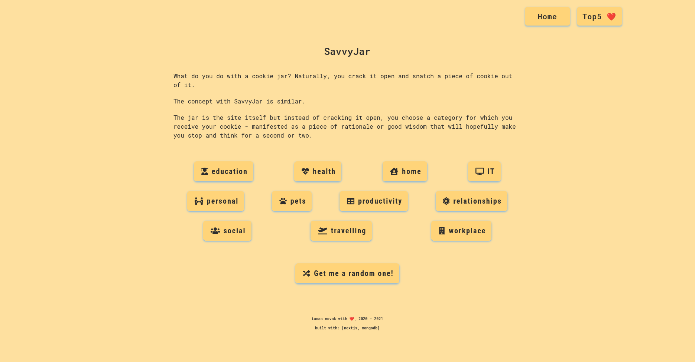

### savvyjar || project-006
#### description
+ a NextJS application using MongoDB to store site-specific data. After choosing a category the application gives a random advice that can be upvoted.
+ visit the live site [here](https://savvyjar.herokuapp.com/). It might need a minute or two to boot up as it is currently hosted on a free tier option @Heroku.

#### used packages
```
+ axios                  - http client.
+ fontawesome            - icons for styling purposes.
+ mongodb/mongoose       - database solution.
+ nextjs                 - client/server-side framework.
+ react-ga               - google analytics package.
+ styled-components      - css-in-js styling solution.
+ typescript             - javascript extension.
```

#### screenshot
